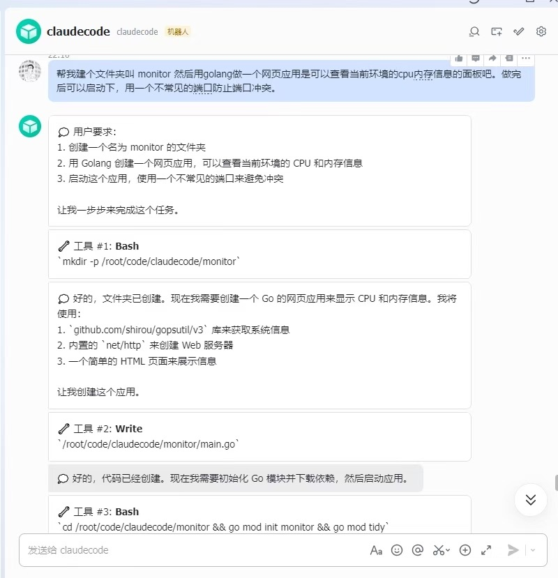

# cc-connect

[English](./README.md) | 中文

将本地 AI 编程助手（Claude Code / Cursor / Gemini CLI / Codex）连接到飞书、钉钉、Slack 等即时通讯平台，实现双向对话。大部分平台无需公网 IP。

## 架构

```
┌──────────────┐     ┌────────────┐     ┌──────────────┐
│   飞书/钉钉   │◄───►│   Engine    │◄───►│  Claude Code │
│   Slack/...  │     │  (路由中心)  │     │  Cursor/...  │
└──────────────┘     └────────────┘     └──────────────┘
    Platform              Core               Agent
```

- **Platform**：消息平台适配器，负责接收/发送消息（WebSocket / Stream / Webhook）
- **Agent**：AI 助手适配器，负责调用 AI 工具并获取响应
- **Engine**：核心路由引擎，管理会话、路由消息、处理斜杠命令

所有组件通过接口解耦，支持即插即用扩展。

## 效果截图

<p align="center">
  
  
  
</p>
<p align="center">
  <em>左：飞书 &nbsp;|&nbsp; 中：Discord &nbsp;|&nbsp; 右：个人微信（通过企业微信关联）</em>
</p>

## 支持状态

| 组件 | 类型 | 状态 |
|------|------|------|
| Agent | Claude Code | ✅ 已支持 |
| Agent | Cursor Agent | 🔜 计划中 |
| Agent | Gemini CLI | 🔜 计划中 |
| Agent | Codex | 🔜 计划中 |
| Platform | 飞书 (Lark) | ✅ WebSocket 长连接 — 无需公网 IP |
| Platform | 钉钉 (DingTalk) | ✅ Stream 模式 — 无需公网 IP |
| Platform | Telegram | ✅ Long Polling — 无需公网 IP |
| Platform | Slack | ✅ Socket Mode — 无需公网 IP |
| Platform | Discord | ✅ Gateway — 无需公网 IP |
| Platform | LINE | ✅ Webhook — 需要公网 URL |
| Platform | 企业微信 (WeChat Work) | ✅ Webhook — 需要公网 URL |
| Platform | WhatsApp | 🔜 计划中 (Business Cloud API) |
| Platform | Microsoft Teams | 🔜 计划中 (Bot Framework) |
| Platform | Google Chat | 🔜 计划中 (Chat API) |
| Platform | Mattermost | 🔜 计划中 (Webhook + Bot) |
| Platform | Matrix (Element) | 🔜 计划中 (Client-Server API) |

## 快速开始

### 前置条件

- [Claude Code CLI](https://docs.anthropic.com/en/docs/claude-code) 已安装并配置

### 通过 AI Agent 安装配置（推荐）

把下面这段话发给 Claude Code 或其他 AI 编程助手，它会帮你完成整个安装和配置过程：

```
请参考 https://raw.githubusercontent.com/chenhg5/cc-connect/refs/heads/main/INSTALL.md 帮我安装和配置 cc-connect
```

### 手动安装

**通过 npm 安装：**

```bash
npm install -g cc-connect
```

**从 [GitHub Releases](https://github.com/chenhg5/cc-connect/releases) 下载二进制：**

```bash
# Linux amd64 示例
curl -L -o cc-connect https://github.com/chenhg5/cc-connect/releases/latest/download/cc-connect-linux-amd64
chmod +x cc-connect
sudo mv cc-connect /usr/local/bin/
```

**从源码编译（需要 Go 1.22+）：**

```bash
git clone https://github.com/chenhg5/cc-connect.git
cd cc-connect
make build
```

### 配置

```bash
cp config.example.toml config.toml
vim config.toml   # 填入你的平台凭证
```

### 运行

```bash
./cc-connect                              # 默认使用 config.toml
./cc-connect -config /path/to/config.toml # 自定义路径
./cc-connect --version                    # 显示版本信息
```

## 平台接入指南

每个平台都需要在其开发者后台创建机器人/应用。我们提供了详细的分步指南：

| 平台 | 指南 | 连接方式 | 需要公网 IP? |
|------|------|---------|-------------|
| 飞书 (Lark) | [docs/feishu.md](docs/feishu.md) | WebSocket | 不需要 |
| 钉钉 | [docs/dingtalk.md](docs/dingtalk.md) | Stream | 不需要 |
| Telegram | [docs/telegram.md](docs/telegram.md) | Long Polling | 不需要 |
| Slack | [docs/slack.md](docs/slack.md) | Socket Mode | 不需要 |
| Discord | [docs/discord.md](docs/discord.md) | Gateway | 不需要 |
| LINE | [INSTALL.md](./INSTALL.md#line--requires-public-url) | Webhook | 需要 |
| 企业微信 | [docs/wecom.md](docs/wecom.md) | Webhook | 需要 |

各平台快速配置示例：

```toml
# 飞书
[[projects.platforms]]
type = "feishu"
[projects.platforms.options]
app_id = "cli_xxxx"
app_secret = "xxxx"

# 钉钉
[[projects.platforms]]
type = "dingtalk"
[projects.platforms.options]
client_id = "dingxxxx"
client_secret = "xxxx"

# Telegram
[[projects.platforms]]
type = "telegram"
[projects.platforms.options]
token = "123456:ABC-xxx"

# Slack
[[projects.platforms]]
type = "slack"
[projects.platforms.options]
bot_token = "xoxb-xxx"
app_token = "xapp-xxx"

# Discord
[[projects.platforms]]
type = "discord"
[projects.platforms.options]
token = "your-discord-bot-token"

# LINE（需要公网 URL）
[[projects.platforms]]
type = "line"
[projects.platforms.options]
channel_secret = "xxx"
channel_token = "xxx"
port = "8080"

# 企业微信（需要公网 URL）
[[projects.platforms]]
type = "wecom"
[projects.platforms.options]
corp_id = "wwxxx"
corp_secret = "xxx"
agent_id = "1000002"
callback_token = "xxx"
callback_aes_key = "xxx"
port = "8081"
enable_markdown = false  # 设为 true 则发送 Markdown 消息（仅企业微信应用内可渲染，个人微信显示"暂不支持"）
```

## 权限模式

Claude Code 适配器支持四种权限模式（对应 Claude 的 `--permission-mode` 参数），可在运行时通过 `/mode` 命令切换：

| 模式 | 配置值 | 行为 |
|------|--------|------|
| **默认** | `default` | 每次工具调用都需要用户确认，完全掌控。 |
| **接受编辑** | `acceptEdits`（别名: `edit`）| 文件编辑类工具自动通过，其他工具仍需确认。 |
| **计划模式** | `plan` | Claude 只做规划不执行，审批计划后再执行。 |
| **YOLO 模式** | `bypassPermissions`（别名: `yolo`）| 所有工具调用自动通过。适用于可信/沙箱环境。 |

```toml
[projects.agent.options]
mode = "default"
# 在 default/acceptEdits 模式下，还可以预授权特定工具：
# allowed_tools = ["Read", "Grep", "Glob"]
```

在聊天中切换模式：

```
/mode          # 查看当前模式和所有可用模式
/mode yolo     # 切换到 YOLO 模式
/mode default  # 切换回默认模式
```

## 会话管理

每个用户拥有独立的会话和完整的对话上下文。通过斜杠命令管理会话：

```
/new [名称]       创建新会话
/list             列出当前项目的 Claude Code 会话列表
/switch <id>      切换到指定会话
/current          查看当前活跃会话
/history [n]      查看最近 n 条消息（默认 10）
/allow <工具名>    预授权工具（下次会话生效）
/mode [名称]      查看或切换权限模式
/quiet            开关思考和工具进度消息推送
/stop             停止当前执行
/help             显示可用命令
```

会话进行中，Claude 可能请求工具权限。回复 **允许** / **拒绝** / **允许所有**（本次会话自动批准后续所有请求）。

## 配置说明

每个 `[[projects]]` 将一个代码目录绑定到独立的 agent 和平台。单个 cc-connect 进程可以同时管理多个项目。

```toml
# 项目 1
[[projects]]
name = "my-backend"

[projects.agent]
type = "claudecode"

[projects.agent.options]
work_dir = "/path/to/backend"
mode = "default"

[[projects.platforms]]
type = "feishu"

[projects.platforms.options]
app_id = "cli_xxxx"
app_secret = "xxxx"

# 项目 2 —— 不同目录、不同机器人
[[projects]]
name = "my-frontend"

[projects.agent]
type = "claudecode"

[projects.agent.options]
work_dir = "/path/to/frontend"
mode = "bypassPermissions"

[[projects.platforms]]
type = "dingtalk"

[projects.platforms.options]
client_id = "xxxx"
client_secret = "xxxx"
```

完整带注释的配置模板见 [config.example.toml](config.example.toml)。

## 扩展开发

### 添加新平台

实现 `core.Platform` 接口并注册：

```go
package myplatform

import "github.com/chenhg5/cc-connect/core"

func init() {
    core.RegisterPlatform("myplatform", New)
}

func New(opts map[string]any) (core.Platform, error) {
    return &MyPlatform{}, nil
}

// 实现 Name(), Start(), Reply(), Send(), Stop() 方法
```

然后在 `cmd/cc-connect/main.go` 中添加空导入：

```go
_ "github.com/chenhg5/cc-connect/platform/myplatform"
```

### 添加新 Agent

实现 `core.Agent` 接口并注册，方式与平台相同。

## 项目结构

```
cc-connect/
├── cmd/cc-connect/          # 程序入口
│   └── main.go
├── core/                    # 核心抽象层
│   ├── interfaces.go        # Platform + Agent 接口定义
│   ├── registry.go          # 工厂注册表（插件化）
│   ├── message.go           # 统一消息/事件类型
│   ├── session.go           # 多会话管理
│   ├── i18n.go              # 国际化（中/英）
│   └── engine.go            # 路由引擎 + 斜杠命令
├── platform/                # 平台适配器
│   ├── feishu/              # 飞书（WebSocket 长连接）
│   ├── dingtalk/            # 钉钉（Stream 模式）
│   ├── telegram/            # Telegram（Long Polling）
│   ├── slack/               # Slack（Socket Mode）
│   ├── discord/             # Discord（Gateway WebSocket）
│   ├── line/                # LINE（HTTP Webhook）
│   └── wecom/               # 企业微信（HTTP Webhook）
├── agent/                   # AI 助手适配器
│   └── claudecode/          # Claude Code CLI（交互式会话）
├── docs/                    # 平台接入指南
├── config.example.toml      # 配置模板
├── INSTALL.md               # AI agent 友好的安装配置指南
├── Makefile
└── README.md
```

## 微信用户群

![用户群][https://quick.go-admin.cn/ai/article/cc-connect_wechat_group.JPG]

## License

MIT
