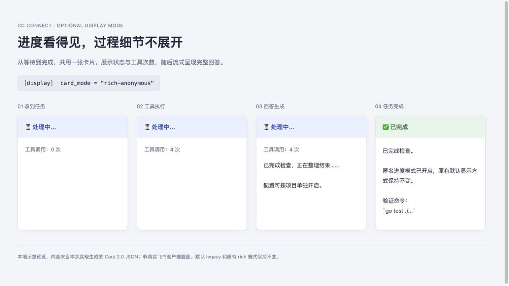

# Anonymous progress cards / 匿名进度卡片

Feishu's optional `rich-anonymous` card mode shows a processing card before
agent startup, updates an anonymous tool-call count, and streams the answer
into that same card. It uses the existing Card 2.0 / CardKit transport.

飞书可选的 `rich-anonymous` 模式会在启动 Agent 之前显示进度卡，随后更新匿名的
工具调用次数，并在同一卡片中流式展示回答。传输复用现有 Card 2.0 / CardKit 实现。

```toml
[display]
card_mode = "rich-anonymous"
```

To enable it for one project only, put this block under that project's
`[[projects]]` entry. Per-project values override the global value.

如需仅对一个项目开启，在对应的 `[[projects]]` 条目下设置：

```toml
[projects.display]
card_mode = "rich-anonymous"
```

- The default remains `legacy`; `rich` retains its existing detailed panels.
  Platforms without the anonymous-card capability retain their normal display.
  Feishu must have `enable_feishu_card = true` (its default).
- The progress payload contains only lifecycle status and the tool-call count.
  Reasoning text, tool names, arguments, results, and generated model/context/
  work-directory footers are omitted. This mode controls progress independently
  of `thinking_messages`, `tool_messages`, and `mode`.
- Answers remain intact, including code and file paths. Permission and question
  prompts still include the details needed to make a decision. Diagnostic
  messages, logs, session history, and agent-authored answer text are not
  redacted by this setting. `hide_agent_footer` remains available separately.
- `[stream_preview] enabled = false` or its `disabled_platforms` setting hides
  intermediate answer text; the processing card remains and receives the final
  answer. CardKit failures use the existing full-card update/send fallback.
- Queued messages get their own card when their turn starts, with a fresh count
  and the correct reply target. A successful immediate card replaces the optional
  `instant_reply` confirmation. Early termination resolves that placeholder.
- `NO_REPLY` is never rendered as answer text. Since this mode shows progress
  immediately, a silent turn can briefly show a placeholder, which is then
  removed if it contains no answer. Feishu may show its usual recall notice.

默认仍是 `legacy`，`rich` 继续显示原有详细面板；未实现此能力的平台保持原有显示方式。
飞书需要开启 `enable_feishu_card`（默认开启）。匿名模式独立控制进度，不显示思考文本、
工具名称/参数/结果，以及自动生成的模型、上下文、工作目录页脚。完整回答和审批所需内容
照常保留；此设置不对错误提示、日志、历史或 Agent 主动写进答案的内容做全面脱敏。

关闭流式预览会隐藏中间回答文本，但保留进度卡和最终回答。排队消息在轮到执行时创建各自
的进度卡并重置计数。静默回答不会显示 `NO_REPLY`；提前展示的空进度卡会移除，客户端可能
显示通常的撤回提示。

## Validation

- `core/anonymous_progress_test.go`: immediate feedback, default compatibility,
  anonymous payloads, permission boundaries, disabled previews, silent turns,
  blocked/failed startup, early exits, and transport fallback.
- `TestCUJ_I2_AnonymousProgressAcrossQueuedTurns`: request work, queue another
  message, inspect status, and observe separate cards with correct targets,
  counts, languages, and answers through `ReceiveMessage`.
- `platform/feishu/anonymous_card_test.go`: five-language rendering, capability
  opt-in, and captured HTTP requests proving one quoted CardKit entity and
  monotonic full-card / per-element updates.

Real Feishu desktop/mobile rendering is **UNVERIFIED** by these automated tests.
Any local preview is an illustration of the generated card JSON, not a screenshot
from a logged-in Feishu client.


