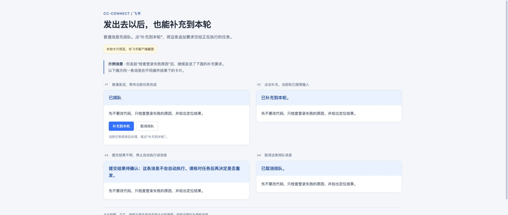

# Feishu: add instructions to the active turn

While a task is running, ordinary messages enter a FIFO queue for later turns. To add instructions to the current turn, click **Add to this turn** (`补充到本轮`) on its queue receipt, or send `/steer <instructions>`.

This release adds Feishu card controls backed by Codex App Server. The default `codex exec` backend continues to support ordinary queued messages.

## Configuration

Set these options in the existing Codex project's configuration:

```toml
[projects.agent.options]
backend = "app_server"
app_server_url = "stdio"
```

Keep the project's existing working directory, model, and permission settings. Restart cc-connect and establish a session. The installed Codex CLI must support App Server's `turn/steer`; `stdio` communicates with a local process.

The Feishu app must enable `card.action.trigger` under **Callback Configuration**, separately from message event subscriptions; see the [Feishu connection guide](feishu.md#第五步配置事件与回调订阅长连接模式). The existing WebSocket connection carries these callbacks. Messages and card callbacks must reach the same cc-connect instance.

## Queue receipt buttons

```text
You: Investigate the login failure.
Bot: Working…

You: Do not change code yet; report the cause first.
Bot: Queued
     Do not change code yet; report the cause first.
     [Add to this turn] [Cancel queued message]
```

- **Add to this turn** (`补充到本轮`) submits that message and its attachments to the exact turn recorded when it was queued. Acceptance removes it from the queue, so it does not run again as a separate turn.
- **Cancel queued message** (`取消排队`) removes that waiting message. The running task continues.

Only the user who started the active task and sent the queued message can use its controls. Callbacks also validate the originating session and chat. Another group member cannot use the card to change that task.

## Direct commands

These commands all use native steering with the Codex App Server backend:

```text
/steer Check whether the token has expired first.
/补充 先检查 token 是否过期。
/補充 先檢查 token 是否過期。
/ps Check whether the token has expired first.
```

They target your active turn in the current session. Missing turns, unsupported backends, and explicit rejections produce a status reply; direct command input is never automatically converted into queued work.

Text may start on the next line, and images or files may accompany the command. If another supplement is still being submitted, the new command is not submitted; wait for that result and retry. A second queue card remains queued until its own action succeeds or it is cancelled.

Codex exec does not support these commands for same-turn input. In particular, `/ps` will not start a concurrent exec process. Send an ordinary message to queue it instead. Other agents retain their existing `/ps` behavior.

## Outcomes

| Status | Behavior |
| --- | --- |
| Queued | Waits for the current turn; the owner may add it to that turn or cancel it. |
| Added to this turn | Codex accepted the input. It will not run again from the queue. |
| Original turn ended | A still-pending message remains queued. It is never redirected into a different active turn. |
| Supplement rejected | A card-submitted message keeps its original FIFO position unless it was recalled during submission. A recalled message stays removed. Direct commands are not queued. |
| Submission outcome unknown | Input might have been accepted. This message is withheld from automatic execution; inspect the task before deciding whether to resend it. |
| Removed from queue | That pending message will not run. The active task continues. |
| Expired or unauthorized | The card is obsolete, the message has left the queue, the session changed, or the user does not match. No input is submitted. |

Acceptance means the turn received the input; a tool already running may continue until it finishes. Use `/stop` to stop the task. Repeating an already-processed button returns its existing outcome without submitting again. Recalling a message cannot retract input that Codex has already accepted.

Submitting, rejection, and original-turn-ended notices use a toast, leaving the queue card in place. Its buttons always revalidate the current state. Only final accepted, cancelled, unknown, or expired outcomes replace the card, so a delayed intermediate callback cannot restore an older card over a final result. When a callback exceeds Feishu's response deadline, the bot delivers its final result asynchronously; failed asynchronous card patches attempt a text fallback.

Queue entries and card-action state are held in memory. Restarting loses pending queue entries and invalidates old controls. Inspect the task's result before resending work that still needs to run.

Quoting your own message does not automatically steer in this release. Quotes provide context; a button or command explicitly requests steering.

## Technical design and review scope

This implements the same-turn semantics discussed in [#619](https://github.com/chenhg5/cc-connect/issues/619#issuecomment-4252574875) and the bounded feature in [#1825](https://github.com/chenhg5/cc-connect/issues/1825). `/steer` is the explicit command. Existing `/ps` and `/btw` remain compatibility routes: native steering when supported, an unsupported response for Codex exec, and unchanged legacy injection for other agents. This does not implement Claude's native side-question command or Codex's native terminal-list command.

### Boundaries and ownership

- `core.AgentSessionSteerer` exposes `CurrentTurnID` and `Steer`; `AgentSessionSupplementPolicy` lets exec opt out of legacy injection. Core checks capabilities and never selects an agent by name.
- Codex sends the bound `expectedTurnId` to `turn/steer` and requires the response `turnId` to match. Explicit RPC rejection is distinct from uncertain transport delivery. Turn completion follows notifications carrying the turn ID, so an old thread-level idle notice cannot finish a newer turn.
- `core.CardTaskActionHandlerSetter` registers a separate task-action handler. Feishu supplies the authenticated operator and chat; core verifies these against the random token's platform instance, session, original turn, and sender, including the effective command permission. Permission-approval handling and its renderer remain separate.
- `interactiveState.mu` owns queue membership, action state, and the one in-flight submission barrier. A promotion claims its queue item under that lock, then releases the lock before calling the backend. Draining waits outside the lock until the bounded submission settles. Rejection keeps the original FIFO slot; acceptance and uncertain delivery remove it before releasing the barrier.
- Successful supplements belong before the active turn's assistant response in stored history, even if the completion event arrives before the RPC response. Streaming output remains independent of this ordering. A replaced or stopped session cannot receive a late history insertion.
- Feishu task receipts opt into shared updates at creation and update time. Intermediate outcomes use toasts; immutable final outcomes replace the original card. Slow callbacks complete asynchronously. Failed asynchronous card patches attempt a text fallback without resubmitting agent input; a failed fallback is logged.

The operation uses a typed status enum with localized labels. The issue's nine rows describe observable scenarios, including preconditions and races; they are not nine distinct stored states. The principal transitions are queued/rejected → submitting → accepted, rejected, or unknown; cancelling removes queued input; an ended target cannot be promoted; obsolete tokens fail validation.

### Scenario and regression coverage

| Observed scenario from #1825 | Required result | Regression coverage |
| --- | --- | --- |
| Original turn active; item queued | Same-turn RPC, one consumption | `TestSteerQueue_DefaultFIFOAndPromotionNeverStartsAnotherTurn`, `TestAppServerSession_SteerPreservesActiveTurnAndAttachments` |
| Promotion races with draining | Only the first path consumes the item | `TestSteerQueue_PromotionSettlesBeforeCompletedTurnDrainsFIFO`, `TestSteerQueue_DrainBeforeClickCannotSubmitTwice` |
| Original turn ended/replaced | Preserve unsubmitted input; reject stale target | `TestSteerQueue_StaleTurnCannotTargetReplacementTurn`, `TestAppServerSession_StaleTurnNotificationsCannotReplaceOrFinishActiveTurn` |
| Duplicate click | Submit at most once; preserve final outcome | `TestSteerQueue_ConcurrentDuplicateCallbacksSubmitOnce`, `TestSteerQueue_NonterminalResponsesCannotOverwriteFinalCard` |
| Explicit rejection | Keep original FIFO position | `TestSteerQueue_RejectionKeepsFIFOButUnknownOutcomePreventsReplay` |
| Timeout/disconnect/ambiguous reply | Withhold automatic replay | `TestAppServerSession_SteerTimeoutAndWriteFailureHaveUnknownOutcome`, `TestSteerQueue_RejectionKeepsFIFOButUnknownOutcomePreventsReplay` |
| Cancel or recall | Remove pending input without claiming accepted input was undone | `TestSteerQueue_CancelRemovesOnlySelectedMessage`, `TestSteerQueue_RecallDuringSubmissionNeverReplaysRecalledInput` |
| Stop/new/restart | Invalidate controls; keep late results out of replacement history | `TestSteerQueue_OldControlsExpireAfterStopNewOrRestart`, `TestSteerCommand_LateAcceptanceAfterNewCannotRestoreClearedHistory` |
| Backend lacks native steering | Accurate refusal and no competing process | `TestSteerCommand_UnsupportedSessionDoesNotFallbackToSend`, `TestSteerCommand_SupplementAttachmentRouting` |

`TestCUJ_A8_QueueAndSteerHaveDistinctVisibleOutcomes` exercises four user actions through `ReceiveMessage` and checks platform-visible receipts and answers. Protocol tests use a fake App Server transport; platform tests use local HTTP servers. These tests do not establish acceptance in a live Feishu client.

Additional boundary regressions cover late RPC acceptance (`TestSteerHistory_LateAcceptancePrecedesAnswer`), command/newline and attachment routing, concurrent commands that must receive an explicit retry notice, shared-card creation/PATCH requirements, shared-app operator routing, and asynchronous delivery fallback. The routing matrix includes native steering, exec opt-out, legacy sessions, and absent sessions.

Future scope: quote shortcuts, QQ/QQBot buttons, configurable default steering, and durable queue recovery. This implementation adds no automatic retry, universal card versioning, or production migration.

## Reproducible local preview



The preview exports actual Chinese cards from `core.queuedTaskCard` for queued, accepted, unknown, and cancelled states. Intermediate and rejected actions show status toasts in Feishu. All content is synthetic; no Feishu account or network connection is used.

From the repository root:

```sh
CC_STEER_PREVIEW_DIR="$PWD/.artifacts/steer-preview" \
  go test ./core -run TestExportSteerCardPreview -count=1
```

Open `feishu-steer-preview.html` in the output directory. The adjacent `feishu-steer-cards.json` contains the card data used for titles, buttons, and notes. The preview uses a fixed light theme and supports desktop and mobile widths.

The page explicitly says **本地卡片预览，非飞书客户端截图** (“Local card preview, not a Feishu client screenshot”). It demonstrates generated card content and local layout. Actual Feishu rendering and callback delivery require separate testing with a connected app.
